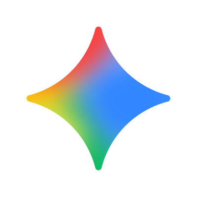
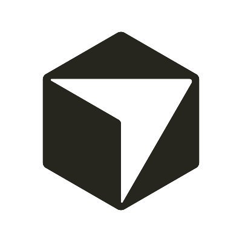
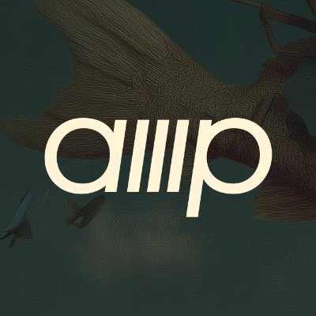

# Tokscale

High-performance CLI tool and web dashboard for tracking AI coding assistant token usage and costs.

## Supported Platforms

| Client | Data Location |
|--------|---------------|
|  | [OpenCode](https://github.com/sst/opencode) — `~/.local/share/opencode/storage/message/` |
|  | [Claude Code](https://docs.anthropic.com/en/docs/claude-code) — `~/.claude/projects/` |
|  | [Codex CLI](https://github.com/openai/codex) — `~/.codex/sessions/` |
|  | [Gemini CLI](https://github.com/google-gemini/gemini-cli) — `~/.gemini/tmp/*/chats/` |
|  | [Cursor IDE](https://cursor.com/) — API sync via `~/.config/tokscale/cursor-cache/` |
|  | [Amp](https://ampcode.com/) — `~/.local/share/amp/threads/` |
|  | [Droid](https://factory.ai/) — `~/.factory/sessions/` |
|  | [OpenClaw](https://openclaw.ai/) — `~/.openclaw/agents/` |
|  | [Kimi Code CLI](https://github.com/MoonshotAI/kimi-cli) — `~/.kimi/sessions/` |

## Quick Start

```bash
# Install and run
bunx tokscale@latest

# Filter by platform
tokscale --kimi
tokscale --claude --kimi
```
